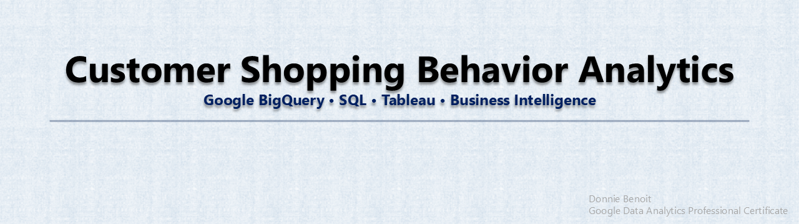
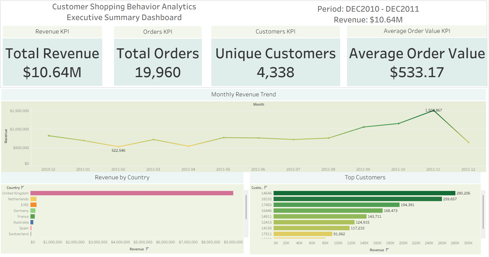

 *
 * 
 * 
 

# 📊 Revenue & KPI Analytics Project

## Business Problem
Organizations need clear visibility into revenue performance, customer contribution, and transactional behavior in order to make data-driven decisions. This project analyzes a transactional dataset to extract key business metrics and identify revenue patterns.

---

## Objective
The goal of this analysis is to:
- Clean and validate raw transactional data
- Establish core KPI metrics (revenue, volume, averages)
- Identify high-value customers and revenue distribution patterns
- Structure data for dashboarding and reporting tools (e.g., Tableau)

---

## Dataset Overview
- Total Records: **524,878**
- Total Revenue: **$10,642,110.80**

This dataset represents transactional activity used for business performance analysis.

---

## Methodology

### 1. Data Cleaning (SQL)
- Removed invalid or null revenue records
- Checked for duplicate transactions
- Standardized dataset into a clean analytical view (`clean_transactions`)

### 2. KPI Development
Key metrics calculated:
- Total Revenue
- Total Transaction Count
- Average Transaction Value
- Revenue by Customer

### 3. Revenue Analysis
- Customer segmentation by revenue contribution
- Daily revenue trend analysis
- Identification of top revenue-generating customers

---

## Key Insights
- Revenue is concentrated among a small subset of high-value customers
- Transaction distribution indicates a strong mid-tier revenue segment
- Data structure supports scalable dashboard development in Tableau

---

## SQL Scripts
- `sql/01_data_cleaning.sql` → Data preparation and validation
- `sql/02_kpi_metrics.sql` → Core business KPIs
- `sql/03_revenue_analysis.sql` → Trend and segmentation analysis

---

## Tools Used
- SQL (data cleaning & analysis)
- GitHub (version control & portfolio hosting)
- PowerPoint (presentation of findings)
- Word (documentation of findings)
  
---

## Dashboards & Reporting
- Interactive Tableau dashboard completed for revenue and KPI visualization
- Executive PowerPoint presentation (12 slides) summarizing key insights
- Detailed written analysis document supporting business findings

---

## Portfolio Artifacts

- 📊 GitHub Repository: SQL-based data cleaning and analysis pipeline
- 📈 Tableau Dashboard: Interactive KPI and revenue visualization
- 🧾 Executive Report: Full written analysis and business interpretation
- 🎤 Presentation Deck: 12-slide executive summary for stakeholders

---

## Live Portfolio Links
- Tableau Dashboard: public.tableau.com/app/profile/donald.benoit/vizzes
- Full Project Repository: This GitHub page

---
